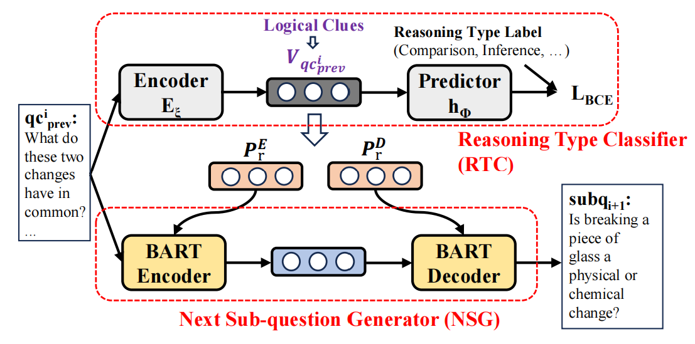
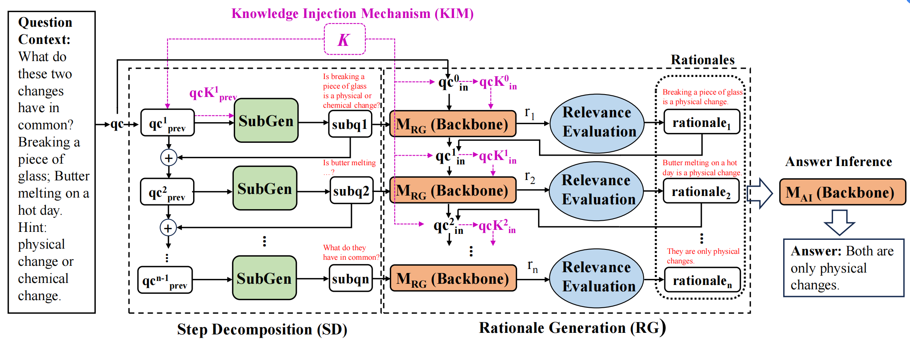

# \[CIKM2024\] Enhancing the Completeness of Rationales for Multi-Step Question Answering

This paper presents Dec-Eval, a two-stage framework designed to enhance the completeness and accuracy of rationales in multi-step question answering. Existing methods, such as Chain-of-Thought reasoning, often generate incomplete or factually erroneous intermediate steps due to insufficient logical planning and evaluation mechanisms. Dec-Eval addresses these limitations by first decomposing complex questions into sub-questions through a ​Step Decomposition (SD) stage, which leverages a ​Reasoning Type Classifier (RTC) to identify logical clues and a ​Next Sub-question Generator (NSG) to iteratively refine sub-questions. In the ​Rationale Generation (RG) stage, a ​Relevance Evaluation Strategy (RSP) filters irrelevant steps, ensuring stepwise coherence. Additionally, a ​Knowledge Injection Mechanism (KIM) incorporates external knowledge to mitigate factual errors during both decomposition and reasoning. Extensive experiments on three challenging datasets (ScienceQA, ComplexWebQuestions, and AppQA) demonstrate that Dec-Eval significantly outperforms state-of-the-art baselines, including MMCoT and Self-Refine, achieving improvements of up to 6.0% accuracy on ScienceQA. Ablation studies confirm the efficacy of each component, while case analyses illustrate how Dec-Eval rectifies missing steps and prevents hallucinations. The framework is versatile, improving both small-scale models (e.g., BART/T5) and large language models (e.g., GPT-3.5), and offers a generalizable solution for enhancing explainable reasoning in complex QA tasks.

## Key Highlights ##
## 1. ​**SubGen: Logical Clue-Driven Question Decomposition**  
- ​**Core Innovation**:  
  Proposes a ​**Step Decomposition (SD) stage** to explicitly plan reasoning steps through:  
  - ​**Reasoning Type Classifier (RTC)**:  
    - Extracts *logical clues* (e.g., keywords like *"have in common"* in sample questions) from the input.  
    - Predicts reasoning types (e.g., comparison, inference) using a BERT-based text encoder.  
  - ​**Next Sub-question Generator (NSG)**:  
    - Iteratively generates sub-questions using a BART-large model.  
    - Integrates logical clues via ​**prefix-tuning** to guide sub-question generation.  
  - ​**Effectiveness**:  
    - Reduces step omission errors (e.g., fixes MMCoT’s missing *"butter melting is a physical change"* step in ScienceQA).  
    - Enables explicit planning for complex multi-step reasoning. 


## 2. ​**Two-Stage Framework: Decomposition-Evaluation (Dec-Eval)**  
- ​**Rationale Generation (RG) Stage**:  
  - Generates rationales step-by-step using a ​**Relevance Evaluation Strategy (RSP)**.  
  - Filters irrelevant steps with a ​**dynamic threshold** (e.g., ε=0.6 for ScienceQA).  
- ​**Knowledge Injection Mechanism (KIM)**:  
  - Augments both decomposition and reasoning stages with external knowledge (e.g., Wikipedia facts).  
  - Uses BERTScore to retrieve and filter high-quality knowledge snippets. 


If the reader wants to know the details of DeAR, please refer to the paper: *[Enhancing the Completeness of Rationales for Multi-Step Question Answering](https://dl.acm.org/doi/abs/10.1145/3627673.3679660)*.
```bibtex
@inproceedings{xue2024enhancing,
  title={Enhancing the Completeness of Rationales for Multi-Step Question Answering},
  author={Xue, Shangzi and Huang, Zhenya and Lin, Xin and Liu, Jiayu and Qin, Longhu and Su, Tianhuang and Liu, Haifeng and Liu, Qi},
  booktitle={Proceedings of the 33rd ACM International Conference on Information and Knowledge Management},
  pages={2753--2763},
  year={2024}
}
```
